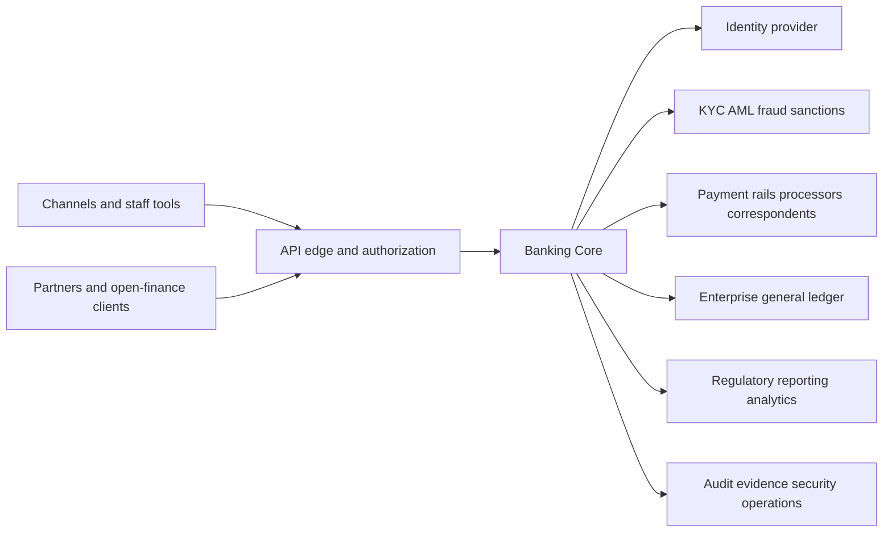
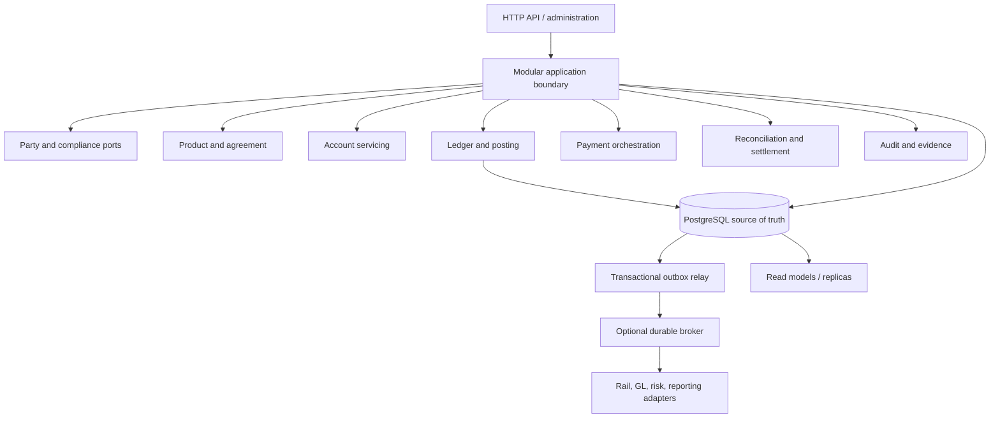

# System context and target architecture

Status: Proposed target, with the initial deployment decisions accepted by ADRs 0001–0003.

## Context

Banking Core is the authoritative operational subledger and account-servicing platform inside a broader regulated institution. It does not replace identity proofing vendors, payment schemes, sanctions sources, card vaults, data warehouses, or a regulator. It owns the financial facts and workflows explicitly assigned to it and exposes evidence-rich contracts to surrounding systems.

Trust does not flow automatically across any arrow. Each connection has authenticated identities, least-privilege authorization, versioned contracts, data classification, timeouts, retry/idempotency semantics, monitoring, and reconciliation where value moves.

## Initial deployable architecture

The first deployable is one application process composed of separately owned modules, backed by PostgreSQL. The ledger write path, idempotency receipt, authoritative balance update, and outbox insertion share one local ACID transaction. Read models and external integrations may be asynchronous.

This diagram is logical. It does not authorize shared-table coupling. Every module owns a schema and publishes an explicit application contract. Only the ledger module may create authoritative postings and balance mutations.

## Architectural layers

- **Domain:** exact value types, aggregates/state machines, rules, accounting effects, and domain policies without infrastructure dependencies.
- **Application:** authenticated use cases, idempotency, orchestration, authorization decisions, transaction boundaries, and ports.
- **Infrastructure:** PostgreSQL, messaging, identity adapters, clocks, cryptography providers, telemetry, and external systems.
- **Interfaces:** versioned HTTP/event/admin contracts and anti-corruption adapters.

This is a dependency rule, not a requirement to create generic repository abstractions or ceremony. Domain behavior must remain visible and testable.

## Deployment and isolation profiles

The codebase must support several profiles without changing financial semantics:

1. developer/conformance: one node and ephemeral test dependencies;
2. single-institution production: dedicated runtime and database, recommended default;
3. multi-entity group: explicit legal-entity partitions and controlled group services;
4. SaaS operator: stronger tenant isolation and control evidence, accepted only after threat modeling and destructive cross-tenant tests.

Logical tenant columns alone are not enough to claim production multi-tenancy. Database, key, backup, telemetry, operator, and incident boundaries are part of the profile.

## Service extraction criteria

A module becomes an independently deployed service only when at least one benefit is measured and the new failure modes are accepted:

- independent scaling cannot be achieved economically inside the current process;
- a regulatory or security boundary requires process/data isolation;
- independent release cadence materially reduces lead time without weakening controls;
- failure containment or regional placement requires a boundary;
- a separately accountable team owns the entire lifecycle.

Before extraction, define consistency changes, idempotency, timeout/retry policy, event ownership, degraded behavior, observability, data migration, reconciliation, recovery, and rollback. Database-per-service is not a substitute for domain ownership.

## Prohibited shortcuts

- direct channel access to ledger tables;
- a shared “common” domain model that couples all modules;
- distributed transactions across institution and payment rail;
- eventual-consistency balances on the authorization/posting command path;
- business decisions encoded only in workflow/UI configuration;
- direct exposure of scheme messages as the internal canonical model;
- treating caches, search indexes, brokers, or analytics stores as the financial source of truth.
